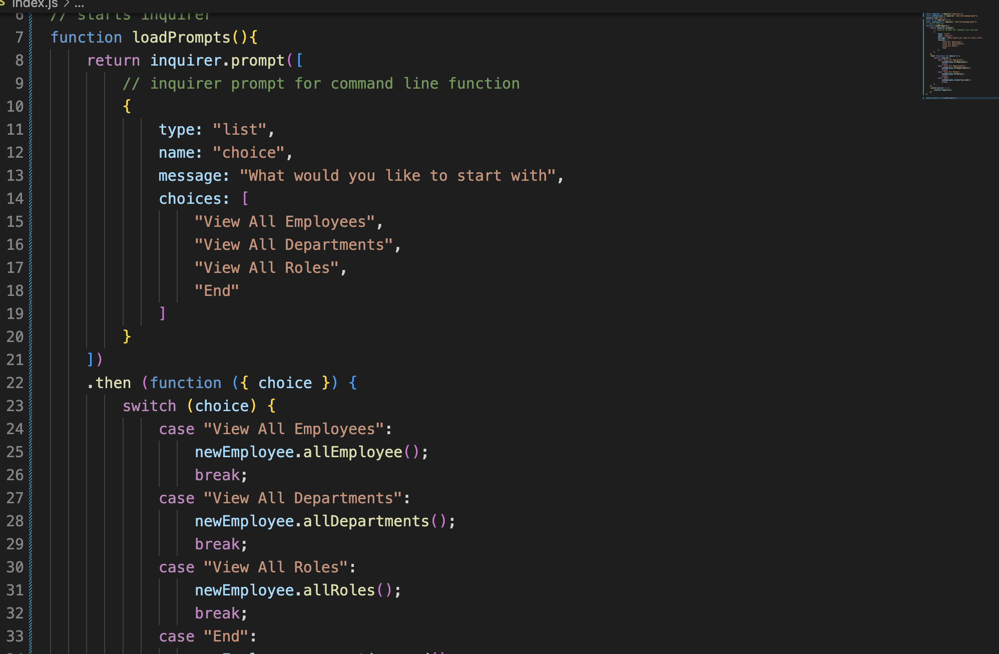
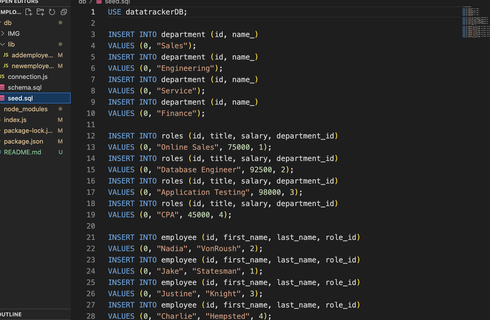
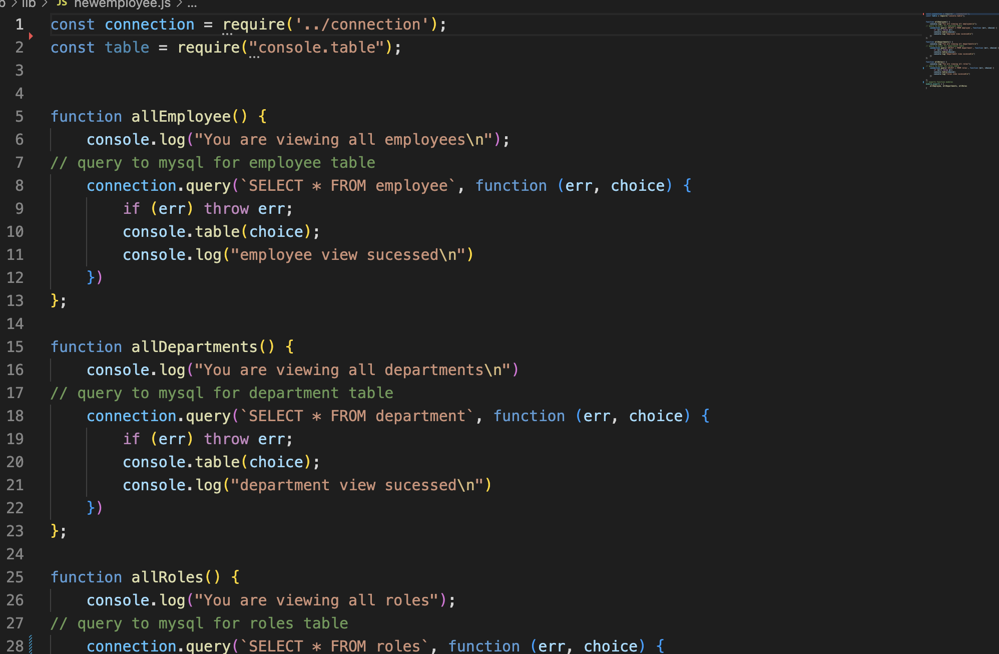

# Employee Tracker

## Introduction
This is a command line MYSQL database query finder
*****

## What you need

*****
This application requires Node and MYSQL. The packages of Node required are inquirer, express and console table. 

## My process
*****

Using MYSQL was my favorite part. I am confident in my execution of syntax of MYSQL. As of now, I can not add new employees but plan on add this functionality at a later date. I had issues through the whole process and my main error was an incorrect dependency for my inquirer package. I used my whole tutor time to get this figured out. My tutor was as stumped as I was. 

This time my errors held me back. Finding the time to get help was a little difficult this week. 
